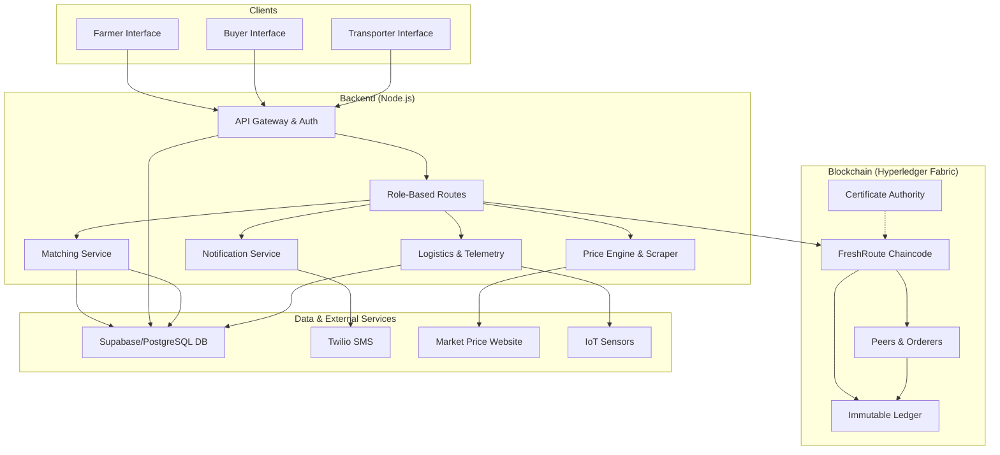

# FreshRoute - Decentralized Farm-to-Fork Supply Chain

FreshRoute is a comprehensive, blockchain-powered platform designed to revolutionize the agricultural supply chain. It directly connects farmers, buyers, and transporters in a transparent, efficient, and secure marketplace, ensuring fair prices, reducing spoilage, and providing end-to-end traceability of produce from the farm to the fork.

For detailed information about the backend services, APIs, and setup, please see the [Backend README](./Backend/README.md).

For detailed information about the Hyperledger Fabric network, chaincode, and setup, please see the [Blockchain README](./Blockchain/README.md).

## Major Updates & Breakthroughs

This platform introduces several key innovations to the agricultural sector:

*   **Decentralized Traceability:** Leverages Hyperledger Fabric to create an immutable, transparent ledger for tracking produce through every stage of the supply chain.
*   **Automated Order Matching:** A sophisticated algorithm connects farmer's stock with buyer's orders, optimizing logistics and ensuring freshness.
*   **Dynamic Price Engine:** Integrates a real-time web scraper to fetch daily market prices, powering a dynamic pricing model and SMS alerts.
*   **IoT-Enabled Logistics:** Designed for integration with IoT sensors to monitor and ensure produce quality during transit.
*   **Role-Based, Secure Access:** A robust authentication system with distinct roles for Farmers, Buyers, and Transporters.
*   **Predictive Analytics:** Includes services for analyzing the accuracy of stock and price forecasts to empower farmer decision-making.

## Architectural Diagram

The FreshRoute platform is built on a multi-tier architecture, ensuring scalability, security, and separation of concerns.



## Technology Stack

*   **Backend:** Node.js, Express.js, PostgreSQL (Supabase)
*   **Blockchain:** Hyperledger Fabric
*   **Key Services:** Twilio, Puppeteer for web scraping, `serialport` for IoT.

## Repository Structure

```
.
├── Backend/
│   ├── README.md       # Detailed backend documentation
│   └── ...             # Backend source code
├── Blockchain/
│   ├── README.md       # Detailed blockchain documentation
│   └── ...             # Fabric network and chaincode
└── README.md           # This file
```

---
*This README provides a high-level overview. For implementation details, refer to the README files within the `Backend` and `Blockchain` directories.*
