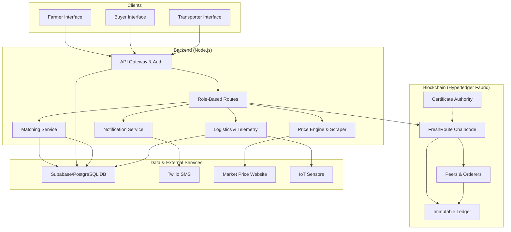

# FreshRoute - Next era of Sri Lankan Fruit Supply Chain

FreshRoute is an intelligent, multi-faceted platform engineered to modernize the agricultural supply chain. It integrates **AI-powered forecasting**, **logistics optimization**, **AI-powered fruit quality assessment** and **blockchain technology** to connect farmers, buyers, and transporters in a transparent, efficient, and data-driven marketplace. The platform's goal is to reduce waste, ensure fair market prices, and provide unparalleled traceability from farm to fork.

For detailed information about the backend services, APIs, and setup, please see the [Backend README](./Backend/README.md).

For detailed information about the Hyperledger Fabric network, chaincode, and setup, please see the [Blockchain README](./Blockchain/README.md).

## Major Updates & Breakthroughs

FreshRoute is built on three core pillars: Artificial Intelligence, Logistics Optimization, and Blockchain.

### 🧠 Artificial Intelligence & Data Analytics
*   **AI-Powered Demand Forecasting:** The platform provides farmers with demand forecasts, helping them predict which crops will be most profitable. An `accuracyInsights` service continually analyzes the performance of these forecasts, creating a feedback loop for model improvement.
*   **Data-Driven Quality Checks:** By integrating with IoT sensors on transport vehicles (`telemetryRoutes`), the platform gathers real-time data like temperature and humidity. This data is crucial for monitoring produce quality during transit and can be used to train models to predict and prevent spoilage.

### 🚚 Advanced Logistics Optimization
*   **Optimized Routing:** A sophisticated route optimizer (`routeOptimizer.js`) uses a greedy nearest-neighbor algorithm to calculate the most efficient sequence of pickups and drop-offs for transporters. This minimizes fuel consumption, reduces delivery times, and lowers costs.
*   **Automated Order Matching:** A core algorithm automatically matches farmer's available stock with buyer's orders, streamlining the procurement process and ensuring the freshest possible produce is routed efficiently.

### 🔗 Blockchain-Grade Trust & Transparency
*   **Decentralized Traceability:** Leverages Hyperledger Fabric to create an immutable, auditable ledger. Every key event, from order placement to final delivery, can be recorded to enhance food safety and build trust among all parties.
*   **Secure & Role-Based Access:** A robust authentication system with distinct roles for Farmers, Buyers, and Transporters ensures data integrity and privacy across the platform.


## Architectural Diagram

The FreshRoute platform is built on a multi-tier architecture, ensuring scalability, security, and separation of concerns.



## Technology Stack

*   **Backend:** Node.js, Express.js, PostgreSQL (Supabase)
*   **Blockchain:** Hyperledger Fabric
*   **AI & Optimization:** Custom algorithms, Puppeteer for data scraping.
*   **Key Services:** Twilio, `serialport` for IoT.

## Repository Structure

```
.
├── Backend/
│   ├── README.md       # Detailed backend documentation
│   └── ...             # Backend source code
├── Blockchain/
│   ├── README.md       # Detailed blockchain documentation
│   └── ...             # Fabric network and chaincode
└── README.md           # This file
```

---
*This README provides a high-level overview. For implementation details, refer to the README files within the `Backend` and `Blockchain` directories.*
